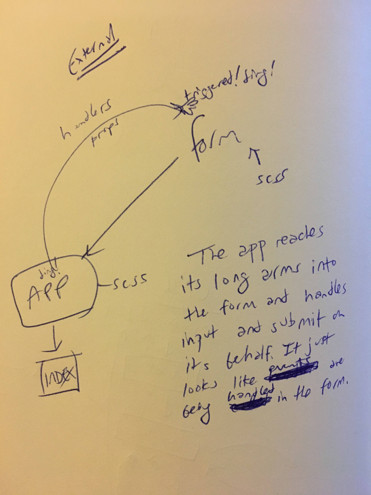

 LAB
=================================================

## Lab 28: Props and State

### Author: Joseph Wolfe

### Links and Resources
* [repo](https://github.com/charmedsatyr-401-advanced-javascript/lab-28)
* Travis: N/A (Code Sandbox)
* [Props Practice](https://codesandbox.io/s/7wkron08oq)
* [Internal State Practice](https://codesandbox.io/s/8l4nznl5ql)
* [External State Practice](https://codesandbox.io/s/94w9jrn8qw)

#### Tests
* What assertions were made?
  * Tests ensure each element renders without crashing. Each dynamic element has functional tests. Snapshot tests don't seem to run well on codesandbox.
* What assertions need to be / should be made?
  * Snapshot tests could be made locally and used to update the repo.

#### UML

